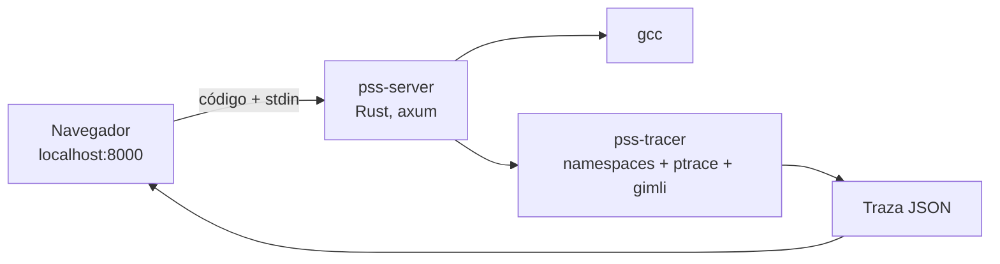

# Propuesta fase 0: estructura del repositorio y esquema de traza

Estado: **aprobado** (27-09-2026). Ver la sección 8 para los ajustes hechos al implementarlo.

Decisiones ya tomadas contigo:

| Tema | Decisión |
| --- | --- |
| stdin | Precargado + "pedir más": si el programa lee y no queda entrada, la traza se detiene y la interfaz te pide más; se reejecuta de forma determinista y sigue |
| Tracer | Rust + gimli (DWARF) + nix (ptrace) |
| Despliegue | Local: se descarga el repo, se ejecuta un comando y se abre `http://localhost:8000` |
| Arquitecturas | x86_64 primero, con capa de arquitectura desde la fase 1; aarch64 (Mac con chip Apple vía Docker) como fase 7 |

## 1. Mediciones hechas en este entorno

| Medición | Resultado | Consecuencia |
| --- | --- | --- |
| Velocidad de `PTRACE_SINGLESTEP` | 13 400 pasos/s | Aceptable dentro del código del usuario (pocas instrucciones por línea con `-O0`) |
| Singlestep de un "hola mundo" desde `execve` | 208 000 instrucciones, 15,5 s | El loader dinámico y libc **nunca** se ejecutan paso a paso: breakpoint en `main` y en direcciones de retorno, como pide el spec |
| Namespace de PID sin privilegios (`unshare -Upf`) | PIDs secuenciales y reproducibles | Hace posible el criterio "misma entrada y semilla, misma traza"; con PIDs reales la salida de `printf("%d", getpid())` cambiaría en cada ejecución |
| ASLR desactivado (`personality(ADDR_NO_RANDOMIZE)`) | Direcciones de stack y heap fijas | Las direcciones que ve el estudiante son estables entre ejecuciones |

## 2. Arquitectura local



Una sola aplicación local. `pss-server` sirve la página, compila con gcc y lanza el tracer por cada ejecución.

Formas de ejecutarlo:

- **Docker (cualquier sistema)**: `docker compose up` y abrir `http://localhost:8000`. La imagen trae gcc, coreutils (`ls`, `grep`, `wc` para los ejemplos con exec), el servidor y la web ya compilada.
- **Nativo (Linux o Windows con WSL2)**: `./pss` compila lo que falte y abre el navegador. Requiere gcc, Rust y Node solo para compilar. Más adelante se pueden publicar binarios ya compilados en GitHub Releases, y entonces bastaría gcc.
- **Solo reproductor**: un `player.html` autocontenido que abre trazas ya grabadas (arrastrar un `.json.gz`) sin servidor, útil para que un profesor comparta una traza. Fase 6.

### Sandbox en modo local

Como cada persona ejecuta su propio código en su propio computador, el objetivo es proteger su máquina de un fork bomb o de un bucle infinito, no protegerse de un atacante. No hace falta un contenedor por ejecución (sección 13 del spec):

- Namespaces nuevos por ejecución: usuario, PID, red (sin red) y montaje (binario en un `tmpfs`).
- El tracer ve cada `fork` y `clone` **antes** de que el hijo ejecute una instrucción, así que aplica los límites de procesos, hilos y pasos de forma determinista: el proceso 33 no llega a correr.
- `rlimit` de memoria, CPU y tamaño de archivos. Si hay cgroups v2 delegados, además `pids.max` y `memory.max`.
- Tiempo real máximo: se mata todo el namespace y la traza queda con `"truncated": true`.
- El límite de peticiones por IP del spec no aplica en local y se omite.

## 3. Estructura del repositorio

```
PSS-Visualizer/
├── pss                          # lanzador: compila lo que falte, inicia el servidor y abre el navegador
├── Makefile                     # build, test, run, traces (regenera trazas de referencia)
├── Dockerfile                   # imagen única multi-etapa
├── docker-compose.yml
├── config/
│   └── limits.toml              # límites de la sección 13 (un solo lugar)
├── schema/
│   ├── trace.schema.json        # EL contrato; fuente de verdad
│   └── README.md                # explicación en prosa del contrato
├── crates/                      # workspace de Rust
│   ├── trace-model/             # tipos serde que corresponden 1:1 al esquema
│   ├── kernel-model/            # modelo puro de fds, pipes, señales y sync (sin ptrace, 100 % testeable)
│   ├── tracer/                  # binario pss-tracer
│   │   └── src/
│   │       ├── arch/            # x86_64.rs (fase 1), aarch64.rs (fase 7): registros, breakpoint, syscalls
│   │       ├── ptrace/          # lanzamiento, waits, eventos, seccomp
│   │       ├── dwarf/           # tabla de líneas, tipos, variables y ubicaciones con gimli
│   │       ├── memory/          # lectura de memoria → árbol de valores
│   │       ├── scheduler.rs     # round-robin, aleatoria con semilla, manual
│   │       ├── sandbox.rs       # namespaces, rlimits, ASLR, pty
│   │       └── main.rs          # CLI: pss-tracer --bin prog --stdin in.txt --policy rr --seed 7
│   └── server/                  # binario pss-server (axum): /api/compile, /api/run, archivos estáticos
├── web/                         # Vite + React + TypeScript
│   └── src/
│       ├── styles/tokens.css    # paleta única de la sección 12 (editor, reproductor e introducción)
│       ├── trace/               # tipos TS generados del esquema, carga (gzip) y consultas por paso
│       ├── editor/              # CodeMirror 6, stdin, diagnósticos de gcc
│       ├── player/
│       │   ├── components/      # ProcessBox, ThreadLane, PipeTube, SignalBlock, MemoryPanel, Console
│       │   ├── layout/          # árbol de procesos (d3-hierarchy), rutas de cables, posiciones estables
│       │   ├── Timeline.tsx
│       │   └── Controls.tsx
│       ├── intro/               # engine.js + un guion por capítulo (fase 6)
│       └── app/
├── examples/                    # 01_structs.c … 16_fork_bomb.c (+ .stdin cuando aplique)
├── traces/
│   ├── synthetic/               # fase 0: trazas escritas a mano
│   └── reference/               # una traza por ejemplo con semilla fija; CI las compara
├── tools/
│   └── synth/                   # pequeño script TS para escribir trazas sintéticas sin repetir estado a mano
└── .github/workflows/ci.yml
```

Pruebas: `cargo test` (modelo de fds y pipes, DWARF, integración con `examples/` contra `traces/reference/`), `vitest` en la web (consultas sobre la traza, resolución de punteros, estabilidad del layout) y validación de toda traza contra `trace.schema.json` en Rust y en TS.

## 4. Esquema de traza (versión 1)

Lo escribo en notación TypeScript porque se lee mejor. En la fase 0 lo paso a `trace.schema.json` (JSON Schema 2020-12), y los tipos de TS se generan desde ahí.

### 4.1 Raíz

```ts
interface Trace {
  version: 1;
  arch: "x86_64" | "aarch64";
  source: string;                    // código C
  stdin: string;                     // entrada usada en esta ejecución (bytes, ver 4.8)
  run: RunConfig;                    // todo lo necesario para reproducir la traza idéntica
  compile: { ok: boolean; command: string; diagnostics: Diagnostic[] };
  outcome: Outcome;
  truncated: boolean;
  truncatedReason?: "steps" | "time" | "processes" | "threads" | "memory" | "output" | "traceSize";
  steps: Step[];
  snapshots: Record<SnapshotId, MemorySnapshot>;   // ver 4.5
  output: OutputChunk[];             // registro único de todo lo escrito a la terminal, en orden de t
  summary: { leaks: Leak[]; memErrors: MemErrorRef[] };
}

interface RunConfig {
  policy: "round_robin" | "random" | "manual";
  seed: number;
  stdinEof: boolean;                 // true: al agotarse el stdin, read devuelve 0 (como `< archivo`)
  schedule: TaskRef[];               // prefijo de planificación forzado (modo manual y ramas)
  injections: { t: number; signal: string; target: "foreground" }[];   // Ctrl+C
  limits: Limits;                    // copia de config/limits.toml usada
}

type Outcome =
  | { kind: "exited"; code: number }                        // terminó el proceso raíz y no quedan tareas
  | { kind: "signaled"; signal: string }
  | { kind: "deadlock"; tasks: TaskRef[] }
  | { kind: "awaitingInput"; pid: number; tid: number }    // stdin agotado y abierto: la interfaz pide más
  | { kind: "truncated" }
  | { kind: "compileError" };

interface Diagnostic { line: number; col: number; severity: "error" | "warning" | "note"; message: string }
interface TaskRef { pid: number; tid: number }
```

La traza no lleva marcas de tiempo ni rutas absolutas del computador: dos ejecuciones con la misma entrada producen el mismo archivo, byte a byte.

### 4.2 Paso

```ts
interface Step {
  t: number;                         // reloj global; t = 0 es el estado inicial, detenido en la primera línea de main
  actor: TaskRef | null;             // tarea que avanzó; null en t = 0 o en pasos solo del kernel (ej. vence una alarma)
  executed?: { line: number; fn: string };   // línea que acaba de ejecutar el actor (flecha verde de Python Tutor)
  choices: TaskRef[];                // tareas listas que el planificador podía elegir (botones "avanzar este")
  clock: number;                     // reloj virtual en ms para sleep y alarm (ver 5.4)
  events: Event[];                   // vacío en un paso de línea común
  processes: Process[];              // estado completo después del paso
  pipes: Pipe[];
  stdin: { size: number; consumed: number; eof: boolean };
  signals: InFlightSignal[];
  timers: Timer[];
  sync: SyncObject[];
}
```

### 4.3 Procesos e hilos

```ts
interface Process {
  pid: number;
  ppid: number | null;               // 1 = adoptado por init (el nodo virtual "init (1)")
  pgid: number;
  state: "running" | "ready" | "blocked" | "stopped" | "zombie" | "reaped";
  createdAt: number;                 // t del fork
  image: { kind: "user"; path: string } | { kind: "blackbox"; path: string; argv: string[] };
  exit?: { code: number } | { signal: string; core: boolean };
  fds: Record<string, Fd>;           // clave = número de fd
  signals: {
    mask: string[];                  // señales bloqueadas
    pending: string[];
    actions: Record<string, { action: "handler"; fn: string } | { action: "ignore" }>;  // solo las no por defecto
  };
  threads: Thread[];                 // el principal primero, luego en orden de creación
  mem: SnapshotId | null;            // null en cajas negras y procesos recogidos
}

type Fd = { cloexec?: boolean } & (
  | { kind: "stdin" }                                  // entrada precargada
  | { kind: "terminal" }                               // consola (fd 1 y 2 por defecto)
  | { kind: "pipe"; pipe: string; end: "r" | "w" }
  | { kind: "file"; path: string; mode: "r" | "w" | "rw" | "a" }
  | { kind: "other"; label: string }
);

interface Thread {
  tid: number;
  main: boolean;
  state: "running" | "ready" | "blocked" | "stopped" | "exited";
  line: number | null;               // próxima línea a ejecutar (flecha roja); si está dentro de libc, la línea que la llamó
  fn: string | null;
  inCall?: string;                   // función de libc en curso, ej. "read" mientras está bloqueado
  blockedOn?: BlockReason;
  start?: { fn: string; arg: Value };   // hilos de pthread_create
  holds: string[];                   // ids de mutex tomados
  inHandler?: string;                // señal cuyo handler está ejecutando
  retval?: Value;                    // al terminar, para dibujar el join
}

type BlockReason =
  | { kind: "read"; fd: number; pipe?: string; stdin?: true }
  | { kind: "write"; fd: number; pipe: string }
  | { kind: "wait"; target: number }                   // -1 = cualquier hijo
  | { kind: "join"; tid: number }
  | { kind: "mutex"; id: string; owner: number | null }
  | { kind: "cond"; id: string; mutex: string }
  | { kind: "sem"; id: string }
  | { kind: "sleep"; until: number }                   // en ms del reloj virtual
  | { kind: "pause" }
  | { kind: "sigsuspend" };
```

`dup2(fd[1], 1)` se ve como `fds["1"] = { kind: "pipe", pipe: "p0", end: "w" }`. El frontend sabe que el fd 1 es stdout y etiqueta el puerto `stdout → p0`.

### 4.4 Pipes, señales y sincronización

```ts
interface Pipe {
  id: string;                        // "p0", "p1"… en orden de creación
  createdBy: number;
  size: number;                      // bytes en el buffer
  buffer: string;                    // primeros 256 bytes (ver 4.8)
  capacity: number;                  // 65536
  readers: { pid: number; fd: number }[];
  writers: { pid: number; fd: number }[];
  broken?: boolean;                  // alguien escribió sin lectores (SIGPIPE)
  warnings: { kind: "unclosedEnd"; pid: number; fd: number; end: "r" | "w" }[];   // tapón gris
}

type SignalSource =
  | { kind: "process"; pid: number; via: "kill" | "raise" }
  | { kind: "kernel"; cause: "SIGCHLD" | "SIGPIPE" | "fault" }
  | { kind: "timer"; pid: number }
  | { kind: "terminal" };

interface InFlightSignal { signal: string; from: SignalSource; to: number; status: "pending" | "blocked" }
interface Timer { pid: number; signal: "SIGALRM"; fireAt: number }   // ms del reloj virtual

type SyncObject = { id: string; pid: number; addr: Addr; name?: string; waiters: number[] } & (
  | { kind: "mutex"; owner: number | null }
  | { kind: "cond" }
  | { kind: "sem"; value: number }
);
```

### 4.5 Memoria (por referencia)

```ts
type SnapshotId = string;            // "m0", "m1"…

interface MemorySnapshot {
  globals: Var[];                    // globales y static
  stacks: Record<string, Frame[]>;   // clave = tid; frame [0] = el más reciente (arriba)
  heap: HeapBlock[];                 // incluye los liberados recientes (freedAt), para dibujarlos rayados
}

interface Frame { fn: string; line: number; params: Var[]; locals: Var[]; signal?: string }  // signal: frame de handler

interface Var { name: string; type: string; addr: Addr; size: number; value: Value; uninit?: true }

type Value =
  | { kind: "scalar"; value: number | string | boolean; repr?: string }   // repr: 'a', RED, 3.14
  | { kind: "pointer"; target: Addr | null; fn?: string }                 // null = NULL; fn = puntero a función
  | { kind: "struct" | "union"; fields: Field[] }
  | { kind: "array"; items: Value[]; text?: string; truncatedFrom?: number }   // text: char[] hasta el \0
  | { kind: "opaque"; note: string };                                     // pthread_mutex_t, FILE*, etc.

interface Field { name: string; type: string; addr: Addr; value: Value; uninit?: true }

interface HeapBlock {
  addr: Addr; size: number; type?: string;          // tipo inferido del puntero que lo apunta
  allocAt: number; allocLine: number; freedAt?: number;
  value: Value;
}

type Addr = string;                  // "0x7fffffffe3d0"
```

**Cambio respecto del spec: la memoria va por referencia.** Cada paso sigue siendo estado completo: `process.mem` apunta a una instantánea completa, nunca a un diff, así que retroceder es solo una búsqueda. Las instantáneas se deduplican por contenido y, si la memoria de un proceso no cambió, el paso reutiliza el mismo id. En cada paso solo cambia la memoria del proceso que avanzó. Si se repitiera la memoria de todos los procesos en cada paso, con 8 a 16 procesos la traza crecería de 8 a 16 veces, y también el tiempo de `JSON.parse` en el navegador.

Por la misma razón, la salida de consola no se repite en cada paso: vive en `trace.output` con su `t`, y la consola de un proceso en el paso `t` son sus fragmentos con `chunk.t ≤ t`.

Los enteros de 64 bits que no caben exactos en un double se envían como string. `NaN` e `Inf` también van como string.

### 4.6 Eventos

```ts
type Event =
  | { type: "call"; fn: string; summary?: string }       // llamada atómica a libc: printf, strlen…
  | { type: "return"; fn: string; value?: Value }        // retorno de función del usuario
  | { type: "fork"; parent: number; child: number; vfork?: true }
  | { type: "threadCreate"; pid: number; creator: number; tid: number; fn: string; arg: Value }
  | { type: "exec"; pid: number; path: string; argv: string[]; blackbox: boolean }
  | { type: "exit"; pid: number; tid?: number; scope: "process" | "thread";
      code?: number; signal?: string; retval?: Value }
  | { type: "wait"; pid: number; target: number; reaped?: number;
      status?: { code: number } | { signal: string } }
  | { type: "join"; tid: number; target: number; retval?: Value }
  | { type: "reparent"; pid: number; from: number; to: 1 }
  | { type: "pipe"; pid: number; pipe: string; fds: [number, number] }
  | { type: "dup"; pid: number; oldfd: number; newfd: number; replaced?: Fd }   // dup y dup2
  | { type: "close"; pid: number; fd: number; was: Fd }
  | { type: "read"; pid: number; tid: number; fd: number; pipe?: string; stdin?: true;
      bytes: string; n: number; eof: boolean; into?: Addr }   // into: variable destino, para animar las cápsulas
  | { type: "write"; pid: number; tid: number; fd: number; pipe?: string; terminal?: true;
      bytes: string; n: number; epipe?: true }
  | { type: "block"; pid: number; tid: number; reason: BlockReason }
  | { type: "unblock"; pid: number; tid: number }
  | { type: "signalSend"; from: SignalSource; to: number; signal: string }   // to < 0: grupo de procesos
  | { type: "signalDeliver"; pid: number; tid: number; signal: string;
      action: "handler" | "ignore" | "terminate" | "core" | "stop" | "continue"; handler?: string }
  | { type: "signalReturn"; pid: number; tid: number; signal: string }
  | { type: "mutex"; op: "lock" | "trylock" | "unlock"; id: string; tid: number;
      result: "acquired" | "blocked" | "busy" | "released" }
  | { type: "cond"; op: "wait" | "signal" | "broadcast" | "wake"; id: string; tid: number; woke?: number[] }
  | { type: "sem"; op: "wait" | "trywait" | "post"; id: string; tid: number; value: number;
      result: "acquired" | "blocked" | "busy" | "posted" }
  | { type: "malloc"; pid: number; fn: string; addr: Addr | null; size: number; oldAddr?: Addr }
  | { type: "free"; pid: number; addr: Addr; error?: "doubleFree" | "invalidPointer" }
  | { type: "memError"; pid: number; tid: number; kind: "useAfterFree" | "segfault"; addr: Addr }
  | { type: "stdinNeeded"; pid: number; tid: number }
  | { type: "deadlock"; tasks: TaskRef[] }
  | { type: "truncated"; reason: string };

interface OutputChunk { t: number; pid: number; fd: number; stream: "stdout" | "stderr"; bytes: string }
```

"Siguiente evento" (Shift + →) salta al próximo paso cuyo `events` contenga algo distinto de `call` y `return`.

### 4.7 Ejemplo: el paso del spec en este formato

El hijo 1001 escribe `hola\n` en `p0`. El padre 1000, que estaba bloqueado leyendo, pasa a listo, pero todavía no lee: los bytes siguen en el tubo, que es justo el momento que se quiere mostrar.

```json
{
  "t": 14,
  "actor": { "pid": 1001, "tid": 1001 },
  "executed": { "line": 12, "fn": "main" },
  "choices": [ { "pid": 1001, "tid": 1001 } ],
  "clock": 0,
  "events": [
    { "type": "write", "pid": 1001, "tid": 1001, "fd": 4, "pipe": "p0", "bytes": "hola\n", "n": 5 },
    { "type": "unblock", "pid": 1000, "tid": 1000 }
  ],
  "processes": [
    {
      "pid": 1000, "ppid": null, "pgid": 1000, "state": "ready", "createdAt": 0,
      "image": { "kind": "user", "path": "prog" },
      "fds": { "0": { "kind": "stdin" }, "1": { "kind": "terminal" }, "2": { "kind": "terminal" },
               "3": { "kind": "pipe", "pipe": "p0", "end": "r" } },
      "signals": { "mask": [], "pending": [], "actions": {} },
      "threads": [ { "tid": 1000, "main": true, "state": "ready", "line": 18, "fn": "main",
                     "inCall": "read", "holds": [] } ],
      "mem": "m3"
    },
    {
      "pid": 1001, "ppid": 1000, "pgid": 1000, "state": "running", "createdAt": 9,
      "image": { "kind": "user", "path": "prog" },
      "fds": { "0": { "kind": "stdin" }, "1": { "kind": "terminal" }, "2": { "kind": "terminal" },
               "4": { "kind": "pipe", "pipe": "p0", "end": "w" } },
      "signals": { "mask": [], "pending": [], "actions": {} },
      "threads": [ { "tid": 1001, "main": true, "state": "running", "line": 13, "fn": "main", "holds": [] } ],
      "mem": "m9"
    }
  ],
  "pipes": [
    { "id": "p0", "createdBy": 1000, "size": 5, "buffer": "hola\n", "capacity": 65536,
      "readers": [ { "pid": 1000, "fd": 3 } ], "writers": [ { "pid": 1001, "fd": 4 } ], "warnings": [] }
  ],
  "stdin": { "size": 0, "consumed": 0, "eof": false },
  "signals": [], "timers": [], "sync": []
}
```

Y la instantánea a la que apunta el hijo:

```json
"m9": {
  "globals": [],
  "stacks": { "1001": [ { "fn": "main", "line": 13, "params": [], "locals": [
    { "name": "fd", "type": "int[2]", "addr": "0x7fffffffe3e8", "size": 8,
      "value": { "kind": "array", "items": [ { "kind": "scalar", "value": 3 }, { "kind": "scalar", "value": 4 } ] } },
    { "name": "msg", "type": "char[16]", "addr": "0x7fffffffe3d0", "size": 16,
      "value": { "kind": "array", "text": "hola\n",
                 "items": [ { "kind": "scalar", "value": 104, "repr": "'h'" }, "…" ] } }
  ] } ] },
  "heap": []
}
```

### 4.8 Bytes

`bytes`, `buffer` y `stdin` son strings donde cada carácter U+0000–U+00FF representa exactamente un byte, así que la codificación es exacta y válida en JSON. El frontend los decodifica como UTF-8 para mostrarlos, de modo que "año" se ve bien, y dibuja `\n` como `↵` y `\0` como `␀`.

## 5. Otras decisiones técnicas

1. **Llamadas a libc atómicas y malloc sin shim.** Al saltar del código del usuario a una función sin información de depuración, el tracer lee sus argumentos, pone un breakpoint en la dirección de retorno y continúa. Con eso ya tiene argumentos y valor de retorno de `malloc`, `free` y `pthread_mutex_lock`, así que **propongo no usar el shim `LD_PRELOAD`** del spec: se evitan el fd oculto y la recursión de `dlsym`. Solo cuentan las asignaciones pedidas por el usuario (`malloc`, `calloc`, `realloc`, `strdup`…), no las internas de libc, como el buffer de `stdout`, que si no aparecería como fuga.
2. **`PTRACE_O_TRACESECCOMP`.** Se agrega a las opciones del spec porque sin él `SECCOMP_RET_TRACE` no produce paradas.
3. **PIDs deterministas.** El programa corre en un namespace de PID nuevo. Dentro hay un init mínimo como PID 1, que recoge huérfanos y es literalmente el nodo "init (1)" del spec. El programa del usuario parte en el PID 1000 (configurable).
4. **Salida como en una terminal.** stdout y stderr van a una pseudo-terminal, así `printf` tiene buffer de línea, igual que cuando el estudiante lo ejecuta en su terminal. stdin es un pipe que alimenta el tracer con la entrada precargada.
5. **Reloj virtual para `sleep` y `alarm` (se confirma en la fase 4).** Nadie duerme de verdad, porque un `sleep(5)` gastaría la mitad del límite de 10 s. El reloj avanza un poco por paso y salta al próximo despertar cuando todas las tareas están dormidas o bloqueadas. Así `alarm(2); pause();` funciona y es reproducible.
6. **Despertares deterministas.** Cuando un paso puede despertar a otra tarea (un write a un pipe con lectores bloqueados, un exit con el padre en wait, un unlock), el tracer espera a que esa tarea llegue a su parada antes de planificar el siguiente paso. Si no, el orden dependería de la velocidad del kernel. Es el punto técnico más delicado y lo cubren pruebas específicas.
7. **Animación.** En el reproductor uso Motion (ex Framer Motion, licencia MIT). La introducción usa un motor propio en `intro/engine.js` (fotograma = f(t), determinista y liviano, para cumplir < 150 KB).

## 6. Qué incluye la fase 0

- Repositorio con la estructura de la sección 3 y CI (build y tests).
- `tokens.css` con la paleta de la sección 12 en tema claro y oscuro, y los 8 tonos de proceso verificados contra WCAG AA.
- `trace.schema.json` y tipos generados en Rust y TS.
- Cuatro trazas sintéticas escritas a mano con `tools/synth`:
  - `fork_pipe`: fork, pipe, write, read, EOF, wait, zombie y recogido.
  - `threads_mutex`: dos hilos, un mutex, bloqueo y join.
  - `signal_handler`: kill, desvío del handler y frame de handler.
  - `structs_heap`: structs anidados, arreglo, lista enlazada en el heap y puntero colgante.
- Reproductor que carga esas trazas y las anima: cuadrados de proceso en árbol, carriles de hilos sobre el eje `t`, tubos con cápsulas, bloque de señal con pulso, panel de memoria con flechas, consola por proceso, controles con atajos y línea de tiempo con marcadores. El editor queda en modo lectura, porque todavía no hay tracer.

Cada elemento se hace a nivel funcional en la fase 0 y se pule en la fase de su tema (por ejemplo, los casos límite de pipes en la fase 3).

## 7. Lo que necesito que confirmes

1. La estructura del repositorio (sección 3).
2. El esquema de traza (sección 4), incluida la **memoria por referencia** (4.5).
3. Servidor en Rust (axum) en vez de FastAPI. Motivo: al ser local, una persona instala un solo binario y no tiene que armar un entorno de Python. Si prefieres FastAPI, se agrega `api/` en Python y el resto no cambia.
4. Eliminar el shim `LD_PRELOAD` de malloc (5.1).
5. Sandbox local por namespaces y límites del tracer, en vez de un contenedor por ejecución (sección 2).

## 8. Ajustes aplicados al implementar la fase 0

Aprobado el 27-09-2026. Al escribir `schema/trace.schema.json` se hicieron estos ajustes, sin cambiar
la idea del contrato:

- `Field` lleva `size` y `ArrayValue` lleva `length` (largo total; `items` puede traer menos). Sin
  ellos el reproductor no puede saber a qué celda exacta apunta un puntero. Reemplaza
  `truncatedFrom`.
- `Fd`, `BlockReason`, `SignalSource`, `SyncObject`, `ExitStatus`, `ProcessImage` y `SignalAction`
  son uniones discriminadas (`oneOf`) con `cloexec` dentro de cada variante de `Fd`, para que los
  tipos de TypeScript y Rust queden exactos.
- `Leak` y `MemErrorRef` quedaron definidos (en la propuesta solo se nombraban), y `MemErrorRef.kind`
  suma `doubleFree` e `invalidFree`.
- Los tipos de Rust (`crates/trace-model`) se escriben a mano y se verifican contra el esquema en
  las pruebas (lectura y reescritura sin pérdida más validación), en vez de generarse.
